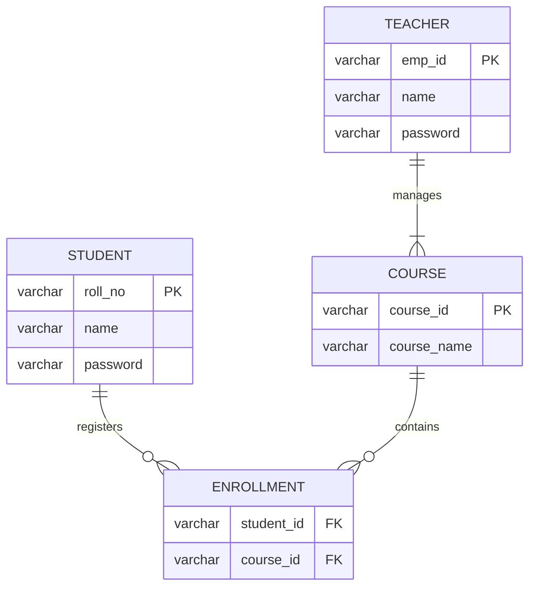

# 🎓 University Course Registration System


> A Desktop-Based University Course Registration System built using **Java Swing** and **Hibernate (JPA)** with MySQL integration.  
> Designed with a clean Dark Academia themed UI and structured using Layered Architecture.

---

## 📌 Overview

This application streamlines university course enrollment by providing:

- 👨‍🏫 Teacher/Admin Panel for managing students and courses
- 👨‍🎓 Student Portal for course registration
- 🗄 Robust database layer powered by Hibernate ORM
- 🎨 Modern Nimbus Dark-Themed Swing UI

The system ensures role-based authentication, data integrity, and conflict prevention during enrollment.

---

# 🚀 Features

## 👨‍🏫 Teacher (Administrator) Module

- Secure Role-Based Login
- Add / Remove Students
- Create / Delete Courses
- View All Students & Their Enrollments
- Academic Monitoring

---

## 👨‍🎓 Student Module

- Personalized Dashboard
- Browse Available Courses
- One-Click Course Registration
- Drop Registered Courses
- Prevent Duplicate Registrations
- Prevent Course Conflicts

---

# 🛠 Tech Stack

| Layer | Technology | Purpose |
|--------|------------|----------|
| Language | Java 21 | Core Logic |
| Frontend | Java Swing | Desktop GUI |
| ORM | Hibernate 6 (JPA) | Object Relational Mapping |
| Database | MySQL 8.0 | Persistent Storage |
| Build Tool | Maven | Dependency Management |

---

# 🗄 Database Architecture

The system follows a relational model with a many-to-many relationship between Students and Courses handled via a join table.



## 📂 Project Structure

```bash
CourseRegistrationApp/
│
├── pom.xml
├── README.md
│
└── src/
    └── main/
        ├── java/
        │   └── com/
        │       └── dark/
        │           ├── entity/
        │           │   ├── Student.java
        │           │   ├── Teacher.java
        │           │   └── Course.java
        │           │
        │           ├── service/
        │           │   ├── LoginService.java
        │           │   ├── StudentService.java
        │           │   └── TeacherService.java
        │           │
        │           ├── swingGUI/
        │           │   └── Main.java
        │           │
        │           └── util/
        │               └── JPAUtil.java
        │
        └── resources/
            └── META-INF/
                └── persistence.xml
```
    

# ⚙ Installation & Setup

## ✅ Prerequisites

- Java JDK 17+
- MySQL Server 8.0
- Maven
- IntelliJ IDEA or Eclipse

---

## 🛠 Step 1: Create Database

```sql
CREATE DATABASE thub_app;
```

---

## 🔐 Step 2: Configure Database

Open:

```
src/main/resources/META-INF/persistence.xml
```
Update your MySQL UserName:

```xml
<property name="jakarta.persistence.jdbc.user" value="YOUR_USER_NAME"/>
```
Update your MySQL password:

```xml
<property name="jakarta.persistence.jdbc.password" value="YOUR_MYSQL_PASSWORD"/>
```

---

## 📦 Step 3: Build Project

```bash
  mvn clean install
```

---

## 🌱 Step 4: Seed Initial Teacher (Admin)

```sql
USE course_db;

INSERT INTO Teacher (emp_id, name, password)
VALUES ('T01', 'Admin User', 'admin123');
```

---

# 🎮 Usage Guide

## ▶ Run Application

Navigate to:

```
src/main/java/com/dark/App.java
```

Run the `main()` method.

---

## 🔑 Teacher Login

```
Role: Teacher
ID: T01
Password: admin123
```

---

## 👨‍🏫 Teacher Actions

- Add Students
- Add Courses
- View Enrollments

---

## 👨‍🎓 Student Flow

1. Teacher creates student account
2. Logout
3. Login as Student
4. Register / Drop courses

---

# 🛡 Key Highlights

- Role-Based Authentication
- Hibernate Many-to-Many Mapping
- Clean Layered Architecture
- Custom Dark UI
- Modular & Scalable Codebase

---

# 🚀 Future Improvements

- Password Hashing (BCrypt)
- Credit Limit Validation
- Timetable Management
- Export Reports
- Docker Deployment

---


---

⭐ If you like this project, give it a star on GitHub!

---